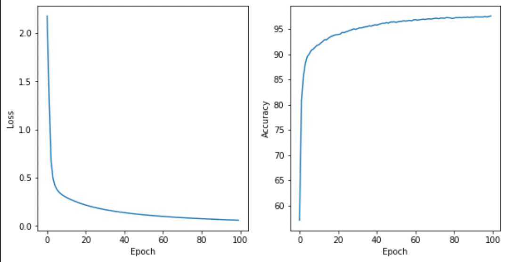
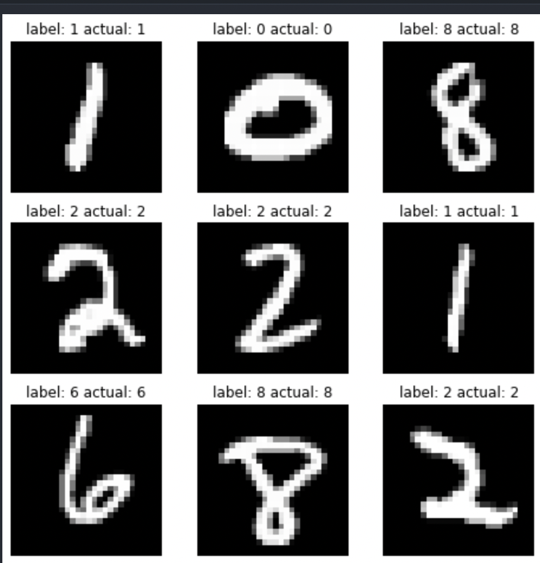

# MNIST tutorial

This code trained MNIST dataset from _torchvision_

PyTorch and Jupyter Notebook was used

## Result

after 1000 epoch the graph looks like the following
> Optimizer is defined by Stochastic Gradient Descent
>
> Loss function is Cross Entropy Loss

It shows that the network is well trained just by using simple 2 hidden layer with 100 neurons each

### Data Outcome

