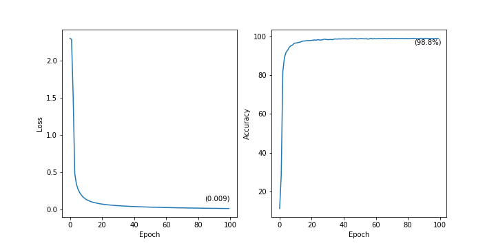

# MNIST trained on various models

Code trained from MNIST dataset in _torchvision_

## Result from Basic MNIST with Deep Neural Network

#### 5m 20s/100 epochs

## Result from LeNet-5

#### 26m 14s/100 epochs

